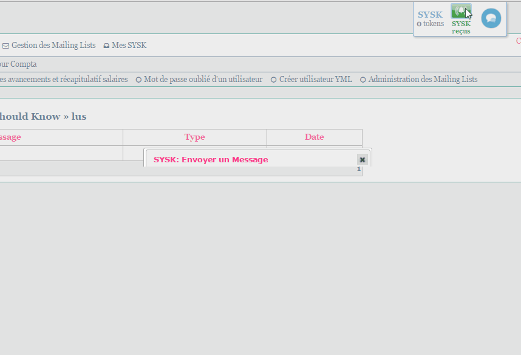

=============

Something-You-Should-Know Alert Bundle
===============

This bundle allow you to easily communicate with other users via small/predetermine messages.

##Requirements
- Symfony 2.3 or higher
- jQuery iu modal

This bundle uses basic jquery modal animations & cripting to allow you to communicate with other users in the page by sending them either positive feedback or predetermined remarks. It works via a token system, where in order to view the different messages you have received, you need to send someone a message. 

1 message = 1 token. 

For 1 token you can see a random message, for 3 tokens, all of them!.

Also, keep in mind that in order to send a remark to a colleague, you need to have send a positive feedback to that same person.

So if there is something you want them to know, let them know!

##Integration:

If you wish to integrate this application, don't hesitate to contact the Davidson  IT/Web team via davidson@davidson.fr